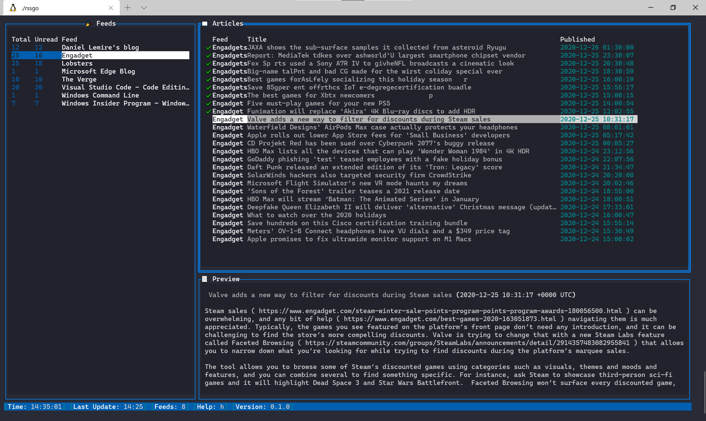

# rssgo

[](https://img.shields.io/github/license/seasona/rssgo)

rssgo is a highly configurable RSS terminal reader written in Golang

## Table of Contents

* [About the Project](#about-the-project)
  * [Feature](#feature)
  * [Platform](#platform)
  * [Built With](#built-with)
* [Getting Started](#getting-started)
  * [Prerequisites](#prerequisites)
  * [Installation](#installation)
* [Usage](#usage)
* [License](#license)

## About The Project



### Feature

- Keyboard shortcut configuration
- Support OPML format
- Support XDG configuration
- Open links in browser
- Configurable theme 
- Preview content of RSS 
- Mark and unmark article
- Backed by SQLite database

### Platform

Linux, Windows

### Built With

Golang with module support version

## Getting Started

### Prerequisites

rssgo use sqlite3 as database

### Installation

```shell
go build ./cmd/rssgo/...
```

## Usage

```shell
Usage of ./rssgo:
  -config string
        Configuration file (default "config.json")
  -db string
        Database file (default "rssgo.db")
  -log string
        Log file (default "rssgo.log")
  -theme string
        Theme file (default "theme/default.json")
  -version
        Show version
```

## License

Distributed under the MIT License. See `LICENSE` for more information.
